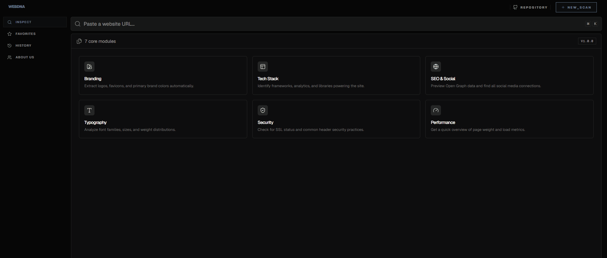
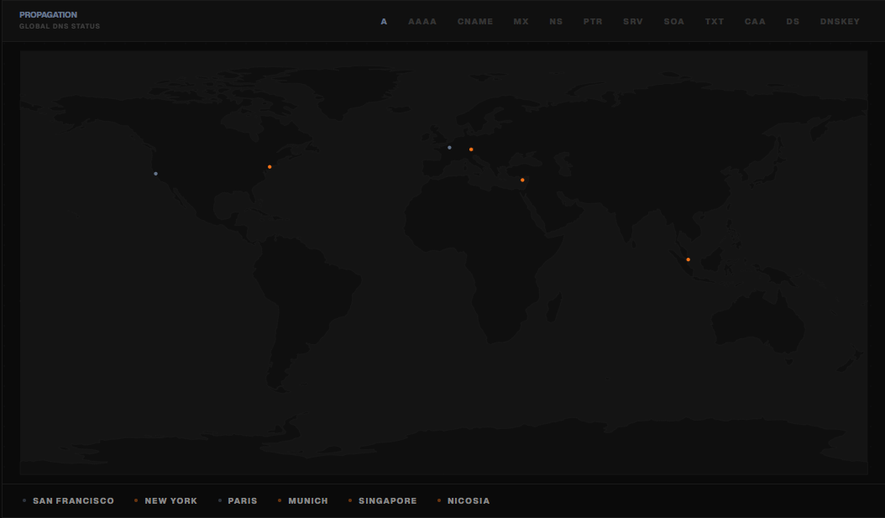

# WebDNA

**Extract the technical and visual identity of any website in seconds.**



[](https://github.com/codespaces/new?repo=xtrafr/webdna)

## What it is

WebDNA is an open source scanning engine that analyzes the genetic makeup of a domain. It extracts infrastructure details, tech stacks, brand assets, and security metrics into a unified report. It includes a specialized WHOIS and DNS propagation scanner developed by b1s4.

## How it differs from web-check

While similar to web-check, WebDNA is designed with three core differences.

1.  **Speed.** WebDNA uses optimized network probes and concurrent scanning to deliver results significantly faster.
2.  **Visual Intelligence.** Beyond network data, it automatically extracts brand colors, typography, and logo assets.
3.  **Density.** The dashboard is built for high information density, allowing developers to see the complete technical profile on a single screen.

## Why it matters

Understanding a website often requires multiple browser tabs, specialized CLI tools, and manual inspection. WebDNA automates this process by transforming unstructured web data into a machine readable format. It provides a programmatic way to audit infrastructure and design.

## Features

*   **Global DNS Propagation.** Real time resolution tracking across multiple global regions.
*   **WHOIS Intelligence.** Comprehensive domain ownership and registration analysis.
*   **Infrastructure Analysis.** Resolve hosting providers, IP addresses, and geographic locations.
*   **Design Extraction.** Identify primary brand colors, typography, and logo assets.
*   **Tech Stack Detection.** Recognize frameworks, libraries, and third-party services.
*   **Asset Explorer.** View the file structure of a site including scripts and stylesheets.
*   **Security Audit.** Detect mixed content and evaluate security policy compliance.

## Global DNS Propagation



## Demo

[Live Demo](https://webdna.xtra.wtf)

## Project Structure

```
webdna/
├── src/
│   ├── lib/
│   │   ├── server/      # Core scanning logic & network probes
│   │   ├── components/  # Reusable UI modules
│   │   └── stores/      # App state and history management
│   └── routes/          # Inspection pages and streaming data
├── static/              # Favicon, OG images, and global assets
├── package.json         # Project dependencies
└── README.md            # This file
```

## Installation

1.  Clone the repository.
    ```bash
    git clone https://github.com/xtrafr/webdna.git
    ```

2.  Install dependencies.
    ```bash
    npm install
    ```

3.  Set up environment variables.
    Create a .env file in the root directory and add your ScrapingAnt API key.
    ```env
    SCRAPINGANT_API_KEY="your_api_key_here"
    ```

4.  Run in development mode.
    ```bash
    npm run dev
    ```

## Example output

WebDNA returns a structured JSON object containing the technical profile.

```json
{
  "name": "Example",
  "domain": "example.com",
  "brandColors": ["#3b82f6", "#1e40af"],
  "fonts": ["Inter", "Roboto"],
  "techStack": [
    { "name": "Next.js", "category": "Framework" },
    { "name": "Tailwind CSS", "category": "Styling" }
  ],
  "infrastructure": {
    "ip": "93.184.216.34",
    "provider": "EdgeCast",
    "location": "Norwell, United States"
  }
}
```

## Use cases

*   **Competitive Intelligence.** Understand the stack and infrastructure used by other platforms.
*   **Security Auditing.** Verify SSL health and header security for client projects.
*   **Design Research.** Automatically harvest brand identity tokens for design inspiration.
*   **Technical Discovery.** Quickly identify the origin and hosting of a mysterious domain.

## Authors

*   **xtrafr.** [xtr4@tutamail.com](mailto:xtr4@tutamail.com) - Owner and Lead Developer.
*   **b1s4.** Whois and DNS Propagation Developer.

## License

MIT © [xtrafr](https://github.com/xtrafr)

---

Made with DNA by xtrafr and b1s4
